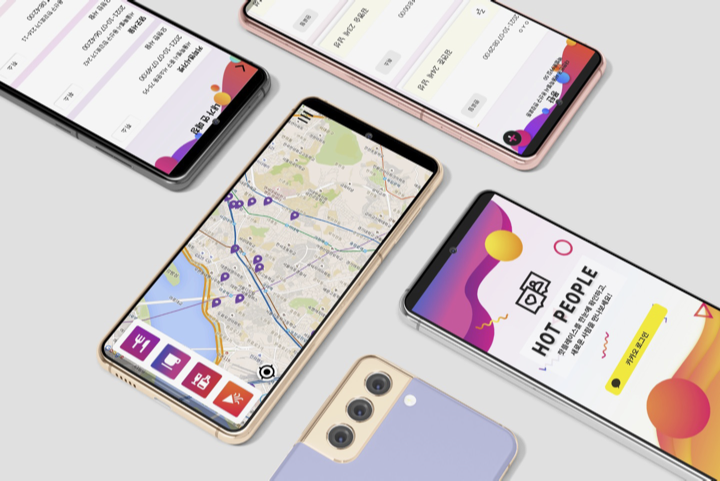

 
 

  

  <h3 align="center">HOT PEOPLE</h3>

  

    <em> 오늘의 <b>핫플</b>에서 새로운 <b>인연<b/>을</em>
     
     
     
  

 
 

# About The Project

**HOT PEOPLE**은 매일 빠르게 변화하는 지역별 핫플레이스를 한눈에 볼 수 있고, 새로운 인연을 위한 1:1 매칭을 지원해주는 앱 어플리케이션 서비스 입니다.

 

 

본 프로젝트는 [**UNI-DTHON 2021**](https://www.unidthon.com/uni-dthon-2021-1) 해커톤 트랙 출품 및 은상 수상작으로, 실제 서비스를 제공하지 않습니다.

 
 

# Features

## 핫플레이스

### 핫플레이스 조회

앱 접속 시, 오늘의 핫플레이스를 바로 확인하실 수 있습니다.

하단의 테마 버튼을 선택하면 **맛집 / 카페 / 술집 / 문화·예술** 테마에 맞는 핫플레이스를 볼 수 있습니다.
 

### 현위치 주변의 핫플레이스

현위치 주변에 있는 핫플레이스도 확인할 수 있습니다.
 

### 핫플레이스 상세정보

핀을 누르면 해당 장소의 정보를 볼 수 있습니다.
 

## 매칭

### 열린 매칭

핫플레이스 선택 후, 우측에 있는 매칭 목록 버튼을 누르면, 해당 위치에 매칭을 연 사람들의 목록이 보입니다.
 
### 열린 매칭 참여

매칭을 올린 사람의 나이와 성별, 메시지를 확인할 수 있고, 종이비행기 버튼을 누르면 매칭 요청을 보낼 수 있습니다. 취소도 바로 가능합니다.

대기중인 매칭을 누르면 내가 참여 요청한 매칭이 뜹니다. 내가 연 매칭과 마찬가지로 취소가 가능합니다.
(다시 메뉴탭 돌아와서)

참여한 매칭을 누르면 내가 참여했던 매칭 기록을 볼 수 있습니다.

### 매칭 열기
직접 매칭을 열고 싶다면, 우측 상단에 있는 플러스 버튼을 눌러서 직접 매칭을 열 수 있습니다. 날짜와 시간을 선택하고 등록하면 됩니다.

### 내가 연 매칭
메뉴 탭을 누르면 나의 프로필을 확인할 수 있습니다. 카카오 로그인을 기반으로 프로필 이미지, 나이, 성별이 표시됩니다. 내가 연 매칭과 대기중인 매칭, 참여한 매칭의 개수를 확인할 수 있습니다.
내 매칭을 누르면 내가 연 매칭 목록이 보입니다. 매칭 장소 이름, 주소, 날짜 / 시간을 확인할 수 있으며 나의 매칭에 수락을 요청한 사람이 있다면 그 사람들의 목록이 보입니다. 거절 버튼을 누르면 매칭을 거절할 수 있고, 수락 버튼을 누르면, 매칭이 성사됩니다. 또는 열었던 매칭을 취소할 수도 있습니다.
 
 
 

# Team Member

<table width="900">
<thead>
    <tr>
        <th width="70" align="center">성명</th>
		<th width="100" align="center">소속</th>
        <th width="250" align="center">Role</th>
        <th width="150" align="center">Github</th>
    </tr> 
</thead>

<tbody>
    <tr>
       <td width="70" align="center">김연준</td>
		<td width="250" align="center">고려대학교 컴퓨터공학과</td>
        <td width="250" align="center">App Frame</td>
        <td width="150" align="center">	
	        
        </td>
    </tr>
    <tr>
        <td width="70" align="center">김진녕</td>
		<td width="250" align="center">성균관대학교 소프트웨어학과</td>
        <td width="250" align="center">App Development</td>
        <td width="150" align="center">	
	        
        </td>
    </tr>
    <tr>
        <td width="70" align="center">서희</td>
		<td width="250" align="center">숙명여자대학교 IT공학과</td>
        <td width="250" align="center">App Design, Data Analysis</td>
        <td width="150" align="center">	
	        
        </td>
    </tr>
    <tr>
        <td width="70" align="center">김명승</td>
		<td width="250" align="center">중앙대학교 소프트웨어학부</td>
        <td width="250" align="center">Infra, Backend Development</td>
        <td width="150" align="center">	
	        
        </td>
    </tr>
</tbody>
</table>
 
 

# Tech Used

- Infra

      

- Backend

      

- Data Analysis

    

- App Frontend

     

 
 

# Algorithm

**[Instagram](https://www.instagram.com/) 인기게시물 기반**으로 지역별 핫플레이스를 매일
